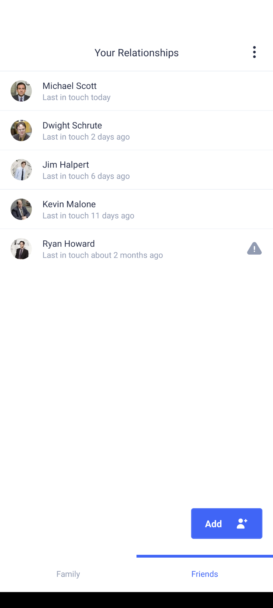
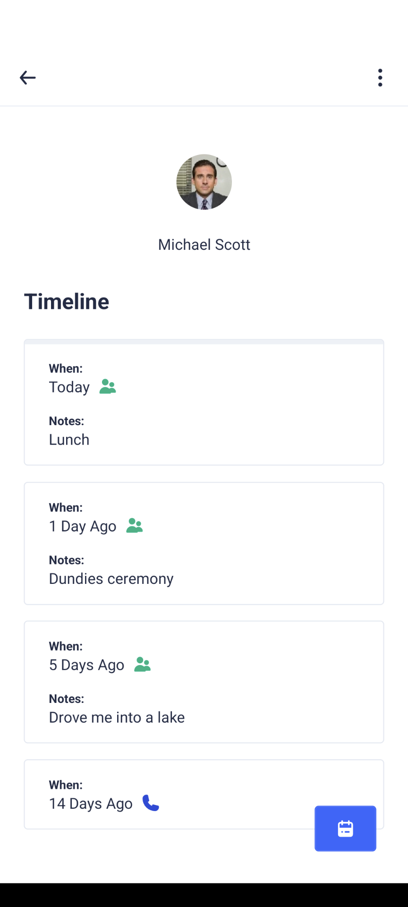
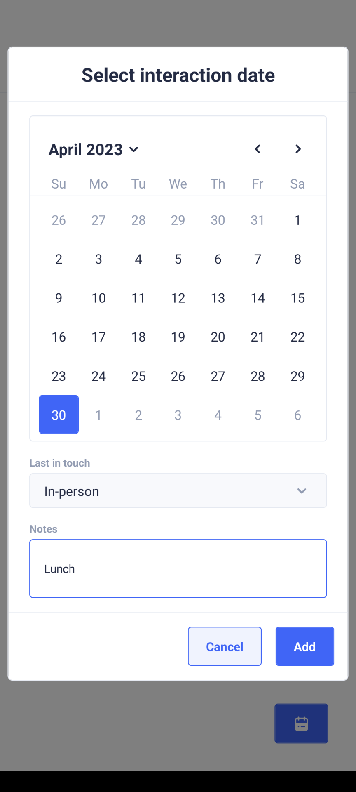

# Pals

Pals is a mobile app built with React Native and Expo that helps you stay connected with your friends and family. It provides a simple and convenient way to keep track of your interactions with the people you care about.

Please note that Pals is currently available **only on Android**, but I might add iOS support in the near future.

## Features

- Import contacts from your phone into your "family" or "friends" list.
- Record your interactions with each contact, whether it's a phone call or an in-person meeting.
- Easily view and track the last interaction date for each contact in the main app view.
- View a detailed timeline of interactions with a particular contact, providing a comprehensive history of your connections.
- Two separate tabs: One for family and one for friends, allowing you to manage and view each list independently.
- Export and import your data to back up your interactions or transfer them to another device.

## Screenshots

   
   
   

## Download and Install

You can download the APK file from the Releases page.

In the future, I might release Pals on the Google Play Store for easier installation.

## Getting Started (Development)

1. Install the dependencies: `npm ci`
2. Start the development server: `npm start`
3. Scan the QR code with the Expo Go app on your Android device to launch the app.

## Dependencies

Pals relies on the following technologies and libraries:

- React Native
- Expo
- Typescript
- TailwindCSS
- UI Kitten
